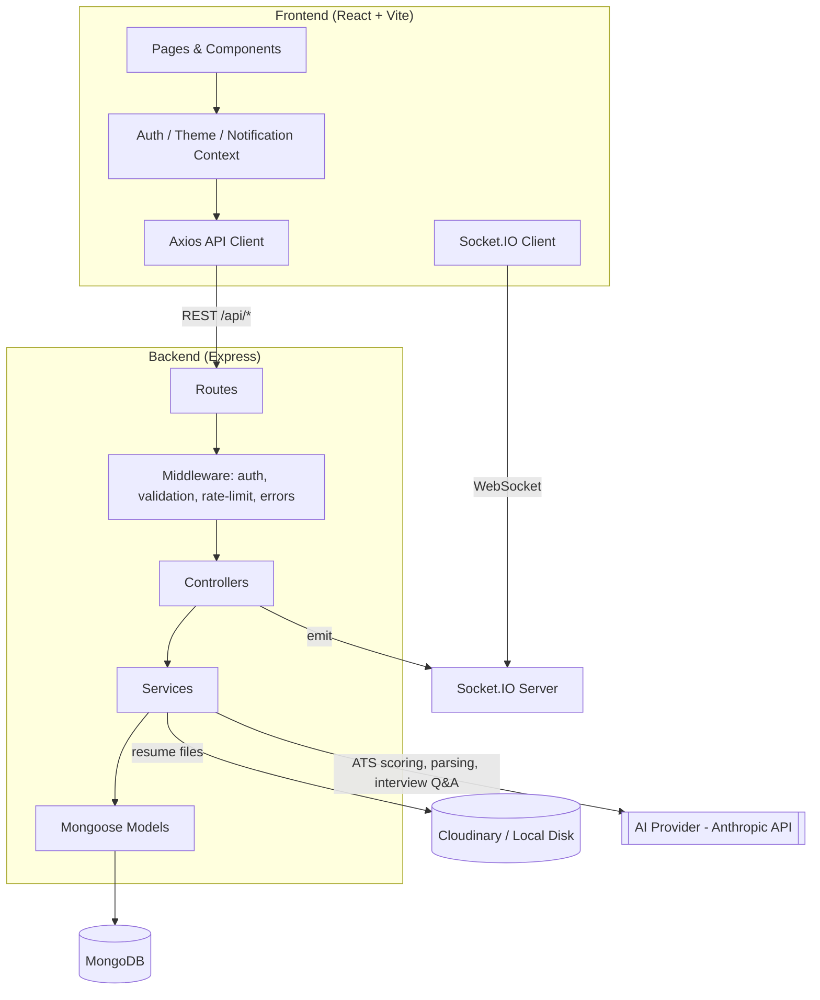
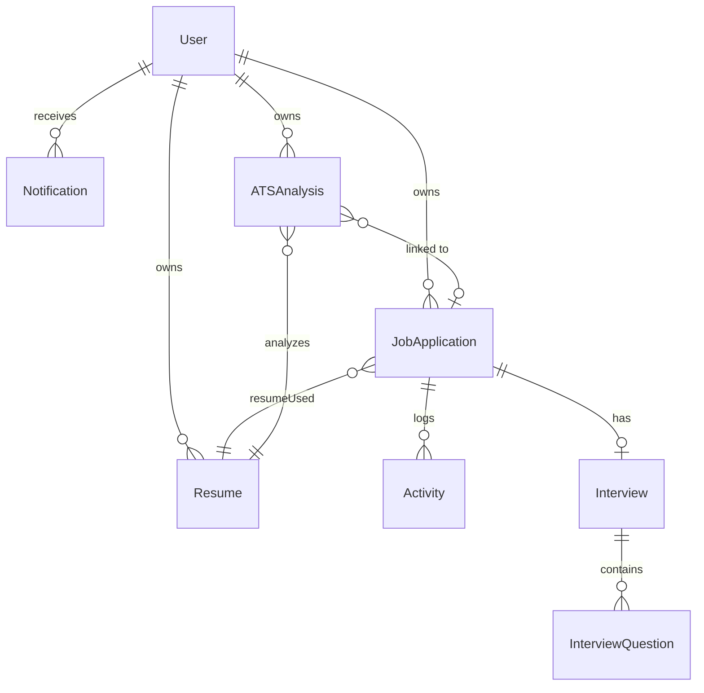
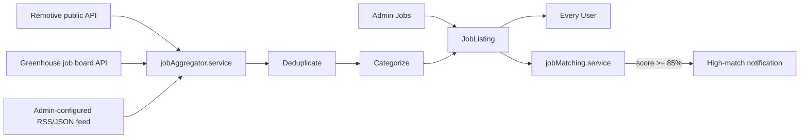

# CareerTrack AI

An AI-powered Job Application Tracker + ATS (Applicant Tracking System) built as a
full-stack SaaS product: React/Vite frontend, Node/Express/MongoDB backend, and a
swappable AI service layer for resume parsing, ATS scoring, and interview preparation.

---

## Table of Contents

- [Overview](#overview)
- [Features](#features)
- [Architecture](#architecture)
- [Tech Stack](#tech-stack)
- [Folder Structure](#folder-structure)
- [ATS Scoring Approach](#ats-scoring-approach)
- [AI Architecture](#ai-architecture)
- [Getting Started](#getting-started)
- [Environment Variables](#environment-variables)
- [Running with Docker](#running-with-docker)
- [API Documentation](#api-documentation)
- [Testing](#testing)
- [Security](#security)
- [Known Limitations / Future Improvements](#known-limitations--future-improvements)

---

## Overview

CareerTrack AI helps job seekers manage their entire job search from one dashboard:
tracking applications through a Kanban board, uploading and parsing resumes,
running a transparent ATS score against any job description, generating
AI-assisted interview prep, and viewing job-search analytics.

## Features

- Email/password auth with JWT access + refresh tokens (HTTP-only cookies), **mandatory email verification before login**, disposable-email-domain blocking, password reset, role-based access (user/admin)
- Resume upload (PDF/DOCX) with background text extraction and structured data parsing (skills, education, experience, projects, certifications)
- Multi-resume management with a "primary" resume
- Job application CRUD with 9-stage status pipeline, priorities, deadlines, contacts, notes
- Kanban board with drag-and-drop status changes (optimistic UI updates)
- Search, filter (status/location/priority), and sort (newest/oldest/highest ATS/priority)
- **Transparent ATS Analyzer**: a real, explainable scoring pipeline (not just "ask the AI for a number")
- Job description analyzer (required/preferred skills, experience, education, seniority)
- AI-grounded resume improvement recommendations (never fabricates experience)
- Interview preparation: technical/behavioral/company-specific question generation grounded in the job's actual field/category (never generic web-dev questions for a non-web-dev role) + AI answer evaluation with a 6-dimension rubric, in both a flat review mode and a sequential **Mock Interview mode** with a final performance-breakdown report
- **AI Application Assistant**: cover letter, recruiter message, LinkedIn message, follow-up, and thank-you generators per application, grounded in real resume/job data with genuine (non-placeholder) fallback templates
- **AI Resume Builder**: structured section-by-section editor (summary/skills/experience/projects/education/certifications/achievements) with AI-assisted summary generation, bullet improvement, and job-description keyword tailoring, plus server-side PDF export to a clean, ATS-friendly layout
- **DSA Tracker**: the standard 16-topic list, per-problem logging, streak tracking, daily/weekly goals, and deterministic weak-topic recommendations
- **Company Tracker**: tracked companies with recruiter contacts/notes and live application/interview/offer counts joined from the application tracker
- Profile pictures (upload/remove, Cloudinary face-cropped or local-disk fallback)
- Real-time notifications (Socket.IO) + persistent notification center + hourly reminder job for deadlines/interviews/follow-ups
- **Automatic job discovery**: a provider-based aggregation engine (Remotive public API, Greenhouse job board API, admin-configured RSS/JSON feeds) that fetches, deduplicates, categorizes, and publishes jobs on a configurable schedule — plus admin-published jobs, both visible to every user from a single shared document (never duplicated per-user)
- **AI job matching**: deterministic, explainable skills/experience/location/education scoring between a user's resume and any job listing, with opt-in high-match notifications
- Job discovery feed (Recommended/New/SDE/Remote/Closing Soon/Saved/Applied), search/filter/sort, save/apply-with-linkback (never falsely claims to submit an external application)
- Admin job-source dashboard (enable/disable/configure/manual sync/sync logs) and full admin job-listing management (create/edit/publish/close)
- Secure email change: current-password verification **and** a one-time code emailed to the new address, both required before the email actually changes
- Per-user notification preferences (new jobs, high-match jobs, interview reminders, application updates)
- Dashboard & analytics: interview rate, offer rate, response rate, charts by status/company/location/time
- Admin dashboard: user management (enable/disable), platform-wide analytics
- Light/dark mode, responsive layout, loading/empty/error states throughout

## Architecture



### Data Flow (ATS Analysis example)

1. Client uploads a resume → `POST /api/resumes` → stored via Cloudinary/local disk → background job extracts text (pdf-parse/mammoth) and calls the AI service to structure it (skills/education/experience), with a deterministic keyword-dictionary fallback if AI is unavailable.
2. Client pastes a job description and selects a resume → `POST /api/ats/analyze`.
3. `ats.service.js` extracts job requirements (AI + deterministic fallback), then computes **deterministic** keyword/skill/experience/education/formatting scores, combines them into a weighted overall score, and only uses AI for the qualitative recommendations layer (never for the raw number).
4. Result is persisted as an `ATSAnalysis` document, linked to the `JobApplication` if provided, and a real-time notification is emitted over Socket.IO.

### Database Relationships



## Tech Stack

**Frontend**: React 18, Vite, React Router, Tailwind CSS, Axios, Recharts, React Hook Form + Zod, Lucide React, Socket.IO client

**Backend**: Node.js, Express, MongoDB + Mongoose, JWT, bcryptjs, Multer, pdf-parse + mammoth, Socket.IO, Helmet, express-rate-limit, express-mongo-sanitize, xss-clean

**AI**: Provider-agnostic service abstraction (`server/src/services/ai.service.js`) — currently wired for the Anthropic Messages API, swappable to any other provider by editing one file. Falls back to safe deterministic mocks if no API key is configured, so the whole app runs end-to-end without one.

**Testing**: Jest + Supertest (backend), mongodb-memory-server for isolated integration tests

**Deployment**: Vercel (frontend), Render/Railway (backend), MongoDB Atlas (database), or self-host via Docker Compose

## Folder Structure

```text
careertrack-ai/
├── client/                 # React + Vite frontend
│   ├── src/
│   │   ├── components/     # Reusable UI components
│   │   ├── pages/          # Route-level pages
│   │   ├── layouts/        # DashboardLayout, AuthLayout
│   │   ├── context/        # Auth, Theme, Notification providers
│   │   ├── services/       # Axios API wrappers per resource
│   │   ├── utils/          # Formatting, constants
│   │   └── App.jsx
│   └── package.json
│
├── server/                 # Express backend
│   ├── src/
│   │   ├── config/         # env, db, storage (Cloudinary/local)
│   │   ├── controllers/    # Request handlers
│   │   ├── services/       # ai.service, ats.service, resumeParser, interview, notification, activity
│   │   ├── models/         # Mongoose schemas
│   │   ├── routes/         # Express routers
│   │   ├── middleware/     # auth, validate, upload, rateLimiter, errorHandler
│   │   ├── validators/     # Zod schemas
│   │   ├── jobs/           # socket.js, reminders.job.js (deadline/interview reminders)
│   │   └── app.js / server.js
│   ├── tests/               # Jest + Supertest
│   └── package.json
│
├── docker-compose.yml
└── README.md
```

## ATS Scoring Approach

The ATS Analyzer is deliberately **not** "ask the AI for a score." The pipeline in
`server/src/services/ats.service.js` works like this:

1. **Extract job requirements** — required/preferred skills, keywords, experience years, education level, seniority — using the AI service with a deterministic skills-dictionary fallback.
2. **Deterministic overlap scoring** — skills and keywords are compared as sets between the resume and the job requirements; the score is `matched / total * 100`, so it's fully explainable.
3. **Deterministic experience/education scoring** — heuristics based on parsed years of experience and highest degree found, compared against what the job asks for.
4. **Deterministic formatting score** — checks resume length, presence of contact info, and standard section headers.
5. **Weighted overall score**: `keywordMatch(20%) + skillsMatch(35%) + experienceMatch(20%) + educationMatch(10%) + formatting(15%)`.
6. **AI qualitative layer** — the AI is used *only* to write recommendations and a short summary, explicitly instructed to never invent skills or experience that aren't in the resume; if the AI is unavailable, deterministic fallback recommendations are used instead.

This means the score never depends on an LLM being available or deterministic, and every category is independently testable (see `server/tests/atsService.test.js`).

## Job Aggregation Architecture

CareerTrack AI never depends solely on admins manually entering jobs. Jobs enter the
platform from three source types, all normalized into one shared `JobListing`
collection — a job is never duplicated per user or per source.



### Provider abstraction

Every source implements the same base class (`server/src/services/jobs/providers/jobProvider.js`):
`fetchRawJobs()` → `normalizeJob()` → `validateJob()`. Adding a new source means writing one
new subclass and registering it in `providerFactory.js` — nothing else in the pipeline changes.

**Built-in providers, all real, legal, and functional (no scraping, no auth-bypassing):**

- **Remotive** (`remotiveProvider.js`) — free, public, unauthenticated, documented JSON API explicitly intended for this kind of consumption. No API key needed.
- **Greenhouse job board API** (`greenhouseProvider.js`) — the public, documented `boards-api.greenhouse.io` endpoint that any company using Greenhouse as their ATS exposes for exactly this purpose. The "board token" is a public identifier, not a secret.
- **Generic RSS/JSON feed** (`rssProvider.js`) — for permitted, publicly-offered job feeds an admin explicitly configures (e.g. a job board's official "subscribe via RSS" feature). Seeded (disabled by default) pointing at We Work Remotely's official programming-jobs RSS feed as a real example.

### Deduplication (`jobDeduplication.service.js`)

Two signals, checked in order:
1. **Same source, same `sourceJobId`** → treated as an update to a job already tracked (refreshes description/salary/location/skills; `lastUpdatedAt` only bumps on a meaningful change).
2. **Cross-source match** on normalized company + normalized title, within a 45-day window → the *same* real-world job discovered via a second source is never duplicated; instead it's recorded in `alternateSources` on the existing listing, preserving attribution to every contributing source.

### Expiration

A job automatically moves to `EXPIRED` when its `deadline` passes, or when a source stops
returning it for more than 48 hours (a grace period that absorbs a single transient sync
failure without flapping jobs in and out of visibility). Expired/closed jobs are never deleted —
they remain visible in application history.

### Sync scheduling

`server/src/jobs/jobSync.job.js` runs on a configurable interval (`JOB_SYNC_INTERVAL_MINUTES`,
default 60) and is also triggerable on demand from the admin dashboard ("Sync Now" per source,
or "Sync All"). Each `JobSource` tracks its own `isSyncing` flag so a source can't overlap with
itself; different sources sync sequentially within one run to stay well under any provider's
rate limits. Every run is recorded in `JobSyncLog` for admin visibility.

### AI job matching (`jobMatching.service.js`)

Reuses the same deterministic-first philosophy as the ATS analyzer, reusing its scoring
primitives directly: skills overlap, experience-years comparison, education-level comparison,
plus a location-fit score (remote jobs always score 100 on location). Weighted
`skills(45%) + experience(25%) + location(15%) + education(15%)`. Results are cached per
(user, job) in `JobMatch` so re-rendering a feed doesn't recompute scoring on every request.

**On notification spam**: after a sync creates new listings, only users whose cached match
score is ≥85% *and* have opted in (`notificationPreferences.highMatchJobs`) are notified —
every user is deliberately **not** notified about every new job, which would be spam at scale.
All users still discover every new job organically via the "New Jobs" feed tab.

## AI Architecture

All AI calls go through `server/src/services/ai.service.js`, which exposes two functions:

- `complete(prompt, options)` — raw text completion
- `completeJSON(prompt, fallback)` — asks the model for strict JSON, parses it, and falls back gracefully on parse failure

Swapping providers means editing only this file (add an entry to the `PROVIDERS` map).
If `AI_API_KEY` is not set, every AI-dependent feature (resume parsing, ATS
recommendations, interview questions, answer evaluation) degrades to a deterministic
or clearly-labeled placeholder response instead of failing, so the product is fully
demoable without any API key.

## Ensuring Real Email Addresses

CareerTrack AI uses two layers to keep out fake/throwaway emails:

1. **Disposable-domain blocklist** (`server/src/utils/disposableEmailDomains.js`) — registration is rejected outright for known temp-mail domains (mailinator.com, yopmail.com, 10minutemail.com, etc.). This is a curated, non-exhaustive list and is a cheap first filter, not a complete solution.
2. **Mandatory email verification via OTP** — on registration, no session is issued. A 6-digit code (hashed with SHA-256 before storage, 10-minute expiry, 5-attempt limit, 60-second resend cooldown — identical semantics to the email-change flow below) is emailed to the address, and the user enters it directly in the app (on the registration confirmation screen, or inline on the login page if they try to log in before verifying). **Login is blocked with a distinct `EMAIL_NOT_VERIFIED` error code until the correct code is entered**, at which point the account is marked verified and the user is logged in automatically.

**Important**: if `SMTP_HOST` / `SMTP_USER` / `SMTP_PASS` are not configured in `server/.env`, verification (and password reset) emails are only logged to the server console, not actually delivered — fine for local development, but you must configure real SMTP credentials (e.g. via SendGrid, Postmark, Mailgun, or Gmail app passwords) before deploying, or email verification provides no real guarantee. See `SMTP_*` in `.env.example`.

**Changing your email later works the same way, deliberately**: `POST /api/users/change-email/request` requires your current password (proves you're the account owner) and immediately emails a 6-digit OTP to the *new* address (proves it's real and reachable) — the code expires in 10 minutes, allows a resend every 60 seconds, and locks out after 5 wrong attempts. Only `POST /api/users/change-email/verify` with the correct code actually changes the stored email. A password-only path that skips the OTP (as a literal reading of some external specs might suggest) was deliberately not implemented, since it would let someone re-introduce a fake/unreachable email after the fact — defeating the point of verifying it at signup.


### Prerequisites

- Node.js 20+
- MongoDB running locally or a MongoDB Atlas connection string
- (Optional) An Anthropic API key for real AI-powered analysis
- (Optional) Cloudinary credentials for cloud file storage (falls back to local disk otherwise)

### 1. Clone and install

```bash
cd careertrack-ai/server && npm install
cd ../client && npm install
```

### 2. Configure environment variables

```bash
cp server/.env.example server/.env
cp client/.env.example client/.env
# edit server/.env with your MongoDB URI, JWT secrets, and (optionally) AI_API_KEY
```

### 3. Run MongoDB (if not using Atlas)

```bash
docker run -d -p 27017:27017 --name careertrack-mongo mongo:7
```

### 4. Seed demo data (optional but recommended)

```bash
cd server && npm run seed
# Creates: admin@careertrack.ai / Admin@12345 and demo@careertrack.ai / Demo@12345
# Also seeds: Remotive job source (enabled), a WWR RSS source (disabled),
# and 5 sample admin-published SDE job listings.
```

### 5. Run the app

```bash
# Terminal 1
cd server && npm run dev

# Terminal 2
cd client && npm run dev
```

Visit `http://localhost:5173`.

## Environment Variables

See `server/.env.example` and `client/.env.example`. Never commit real secrets —
`.env` is gitignored.

## Running with Docker

```bash
docker compose up --build
```

This starts MongoDB, the backend API (port 5000), and the frontend served via
Nginx (port 5173). Set `JWT_SECRET`, `JWT_REFRESH_SECRET`, and optionally
`AI_API_KEY` / Cloudinary / `SMTP_*` / `JOB_SYNC_INTERVAL_MINUTES` variables in
your shell or a `.env` file at the repo root before running —
`docker-compose.yml` reads them via `${VAR}` substitution. The backend
container needs outbound internet access to reach the job-source APIs
(Remotive, Greenhouse, or any configured RSS feed) for automatic job sync to
work.

## API Documentation

All responses follow a consistent envelope:

```json
{ "success": true, "message": "...", "data": {} }
```

```text
POST   /api/auth/register
POST   /api/auth/verify-email
POST   /api/auth/resend-verification
POST   /api/auth/login
POST   /api/auth/logout
GET    /api/auth/me
POST   /api/auth/refresh
POST   /api/auth/forgot-password
POST   /api/auth/reset-password
POST   /api/auth/change-password

GET    /api/users/profile
PUT    /api/users/profile
PUT    /api/users/notification-preferences
POST   /api/users/profile-picture
DELETE /api/users/profile-picture
POST   /api/users/change-email/request
POST   /api/users/change-email/verify

POST   /api/resumes
GET    /api/resumes
GET    /api/resumes/:id
DELETE /api/resumes/:id
PUT    /api/resumes/:id/primary

POST   /api/resumes/builder                          # create a new structured (Resume Builder) draft
PUT    /api/resumes/builder/:id                       # save structured fields
POST   /api/resumes/builder/:id/export                # generate + upload the PDF, returns download URL
POST   /api/resumes/builder/:id/ai/summary
POST   /api/resumes/builder/:id/ai/improve-bullet
POST   /api/resumes/builder/:id/ai/optimize-keywords

POST   /api/jobs                          # JobApplication tracker (your own applications - unrelated to job discovery below)
GET    /api/jobs                 ?search=&status=&location=&priority=&sort=&page=&limit=
GET    /api/jobs/:id
PUT    /api/jobs/:id
PATCH  /api/jobs/:id/status
PATCH  /api/jobs/:id/notes
DELETE /api/jobs/:id
POST   /api/jobs/:id/interview
GET    /api/jobs/:id/interview
POST   /api/jobs/:id/interview/answer
POST   /api/jobs/:id/assistant             { type: cover_letter | recruiter_message | linkedin_message | follow_up | thank_you }
GET    /api/jobs/:id/assistant

GET    /api/dsa/summary
PUT    /api/dsa/goal
POST   /api/dsa/entries
GET    /api/dsa/entries          ?topic=&difficulty=&page=&limit=
DELETE /api/dsa/entries/:id

POST   /api/companies
GET    /api/companies
PUT    /api/companies/:id
DELETE /api/companies/:id

GET    /api/career-score

# --- Job discovery (JobListing) - deliberately NOT under /api/jobs to avoid
# colliding with the JobApplication tracker above ---
GET    /api/job-board                     ?search=&location=&workMode=&employmentType=&category=&company=&sort=&page=&limit=
GET    /api/job-board/new
GET    /api/job-board/closing-soon
GET    /api/job-board/remote
GET    /api/job-board/sde
GET    /api/job-board/recommended
GET    /api/job-board/saved
GET    /api/job-board/applied
GET    /api/job-board/:id
POST   /api/job-board/:id/save
DELETE /api/job-board/:id/save
POST   /api/job-board/:id/apply
POST   /api/job-board/:id/match

POST   /api/ats/analyze
GET    /api/ats/:id
GET    /api/ats/resume/:resumeId

GET    /api/analytics/dashboard

GET    /api/notifications
PUT    /api/notifications/:id/read
PUT    /api/notifications/read-all

GET    /api/admin/users
PUT    /api/admin/users/:id/toggle-active
GET    /api/admin/analytics

GET    /api/admin/job-sources
POST   /api/admin/job-sources
PATCH  /api/admin/job-sources/:id
DELETE /api/admin/job-sources/:id
POST   /api/admin/job-sources/:id/sync
POST   /api/admin/job-sources/sync-all
GET    /api/admin/job-sync-logs

GET    /api/admin/job-listings            ?status=&source=&category=&company=&page=&limit=
GET    /api/admin/job-listings/analytics
POST   /api/admin/job-listings
PATCH  /api/admin/job-listings/:id
PATCH  /api/admin/job-listings/:id/publish
PATCH  /api/admin/job-listings/:id/close
DELETE /api/admin/job-listings/:id
```

## Testing

```bash
cd server && npm test
```

Covers: auth flows (register/login/duplicate/weak password/protected routes),
job application CRUD + cross-user authorization, the ATS scoring service
in isolation, and job-discovery unit tests (categorization, deduplication
normalization, match scoring, OTP generation/hashing/cooldown) — all
deterministic, no AI key or network access required. Tests use
`mongodb-memory-server` for a fully isolated database per test run.

## Security

- Helmet, CORS locked to `CLIENT_URL`, request size limits
- express-rate-limit (general + stricter auth-specific limiter)
- express-mongo-sanitize + xss-clean against NoSQL injection / XSS
- bcrypt password hashing, HTTP-only cookies for tokens
- File uploads validated by both MIME type and extension, 5MB limit
- Centralized error handler that never leaks stack traces in production
- Role-based authorization middleware on all admin routes

## Known Limitations / Future Improvements

- Email delivery is wired to real SMTP via `nodemailer` when `SMTP_*` env vars are configured; without them, verification/reset/OTP emails are logged to the console instead of delivered (see "Ensuring Real Email Addresses" above).
- The reminders and job-sync background jobs use simple `setInterval` calls rather than a durable job queue (BullMQ/Agenda) — fine for a single-instance deployment, but should be upgraded before horizontal scaling so scheduled work isn't duplicated across instances.
- The ATS/job-matching keyword-skills dictionary is a curated list and can be extended for more domains.
- No payment integration — the landing page pricing section is UI-only, as scoped.
- **Job source secrets**: the two built-in API providers (Remotive, Greenhouse) require no secret credentials at all (both are genuinely public, unauthenticated APIs), so `JobSource.config` never needs to store sensitive material. If a future provider ever requires a real API key, it should be read from a server-side environment variable referenced by name, never stored in MongoDB in plaintext.

### Since the platform upgrade: all six originally-deferred features are now built

The original platform-upgrade pass deferred six substantial features to avoid shipping
hollow implementations. All six have since been built and verified end-to-end:

- **AI Resume Builder** — structured editor (summary/skills/experience/projects/education/certifications/achievements), AI-assisted summary generation and bullet improvement (grounded only in what the user actually wrote), a job-description keyword-tailoring assistant, and server-side PDF export via `pdfkit` producing a clean, single-column, ATS-friendly layout (visually verified by rendering a real generated PDF to an image).
- **AI Application Assistant** — cover letter, recruiter message, LinkedIn message, follow-up, and thank-you generators per application, with real deterministic fallback templates (not placeholders) when AI isn't configured.
- **Sequential Mock Interview mode** — a timed "one question at a time" flow layered on top of the existing question generation/evaluation, ending in a performance-breakdown report averaged across all six evaluation dimensions.
- **SDE DSA Tracker** — the standard 16-topic list, per-problem logging, streak calculation (verified against multiple edge cases: same-day, gap, and "not yet solved today" scenarios), daily/weekly goals, and deterministic weak-topic recommendations.
- **Company Tracker** — tracked companies with recruiter contacts and notes, showing live application/interview/offer counts joined from the existing application tracker (never a duplicated/stale count).
- **CareerTrack Score** — a single aggregate score combining Resume/DSA/Skills/Projects/Applications/Interview readiness, entirely from real existing data (see dedicated section below).
- Profile pictures (Cloudinary face-cropped upload or local-disk fallback) and registration verification switched from a clickable link to an emailed 6-digit OTP, consistent with the email-change flow.

### Still deferred

- Encrypting job-source credentials at rest — still not needed, since the built-in providers (Remotive, Greenhouse) require no secret credentials at all. Would matter if a future provider requires a real API key.

## CareerTrack Score

A single aggregate score (`GET /api/career-score`) combining six categories, each traceable
back to real, already-existing data — never an AI guess:

| Category | Source |
|---|---|
| Resume | Latest ATS analysis score for the primary resume, or a completeness heuristic if none exists yet |
| DSA | Weighted solved-problem count (harder problems count more) against a target, with a small streak bonus |
| Skills | Average "skills match" score from real `JobMatch` history against jobs the user has actually been matched to |
| Projects | Number and quality (has a real description) of resume projects |
| Applications | Job-search activity level over the last 30 days |
| Interviews | Average mock-interview score, falling back to interview conversion rate from the application funnel |

Weighted `resume(20%) + dsa(15%) + skills(20%) + projects(15%) + applications(15%) + interviews(15%)`
into the overall score, shown as a dial on the dashboard alongside a per-category breakdown.
Recommendations surface the 1-3 weakest categories with a concrete next action (e.g. "Practice
more DSA problems — try Graphs today").
